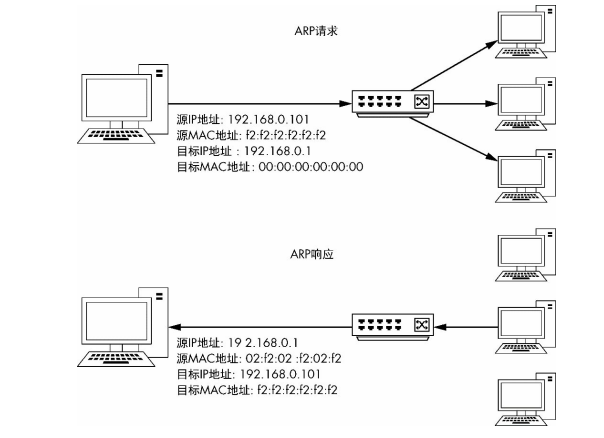
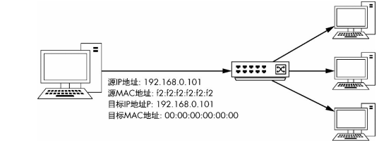
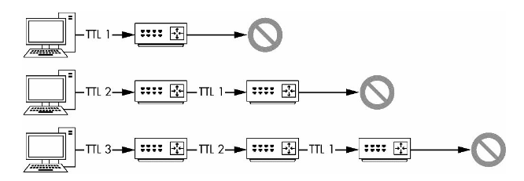
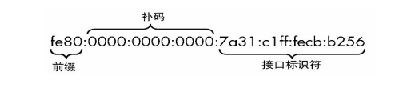
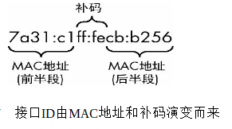
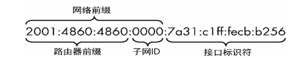

# 网络层协议
## 地址解析协议（ARP）
### ARP解析过程
网络上的通信会使用到逻辑地址和物理地址。逻辑地址允许不同网络以及间接相连的设备之间相互通信，物理地址则用于同一网段中直接使用交换机相互连接的设备之间进行的通信。在大多数情况下，正常通信需要这两种地址协同工作。

当一个以太帧通过交换机的某个端口传入时，交换机会自动记录下该以太帧的源mac地址与该端口的映射关系。

mac地址的长度为48位(6个字节)，通常表示为12个16进制数，如：00-16-EA-AE-3C-40就是一个mac地址，其中前3个字节，16进制数00-16-EA代表网络硬件制造商的编号，它由IEEE(电气与电子工程师协会)分配，而后3个字节，16进制数AE-3C-40代表该制造商所制造的某个网络产品(如网卡)的系列号。

ARP协议只有两种类型的数据包：一个ARP请求包与一个ARP响应包。

当一个主机要向局域网内的另一个主机通信但又不知道它的mac地址时，会对该网段内的所有主机广播一个ARP请求包：

> 在Windows主机中，可以通过在命令行中键入arp -a来查看ARP表。

### Gratuitous ARP
多数情况下，一个主机的IP是会改变的，而当这种改变发生后，主机缓存的IP与MAC地址的映射关系就失效了。为了防止造成通信错误，Gratuitous ARP请求会被发送到网络中，强制所有收到它的设备去用新的IP和MAC地址映射更新缓存：

## 互联网协议
### IPv4
IPv4地址是一个32位的地址，包头20字节，用来唯一标识连接到网络的设备。

每个IP地址都包含着两个部分：网络地址和主机地址。网络地址用来标识设备所连接到的局域网，而主机地址则标识这个网络中的主机本身。

为简便起见，IP地址和网络掩码通常会被写成无类型域间选路（Classless Inter-Domain Routing，CIDR）的形式。在这个形式下，一个完整的IP地址后面会跟有一个左斜杠（/），斜杠右边的数字表示网络部分的位数。举例来说，IP地址10.10.1.22和网络掩码255.255.0.0，在CIDR表示法下就会被写成10.10.1.22/16的形式。

TTL是一个IP包所能够经过的最大路由器数目，TTL在数据包被创建时就会被定义，而且通常在每次被发往一个路由器的时候减1：

以太网的默认MTU是1500，也就是说以太网的网络上所能传输的最大报文大小是1500字节（并不包括14字节的以太网头本身）。

当一个设备准备传输一个IP数据包时，它将会比较这个数据包的大小，以及将要把这个数据包传送出去的网络接口MTU，用以决定是否需要将这个数据包分片。如果数据包大小大于MTU，那么这个数据包就会被分片。

当一个IP包要分片时，会按如下步骤进行：
1. 设备将数据分为若干个将要接下来进行传输的数据包。
2. 设置每个IP分片相同的标识符。
3. 每个IP头的总长度字段会被设置为每个分片的片段长度。
4. 除了最后一个分片数据包外，之前所有分片数据包的标志位都被标识为1。
5. 设置每个IP分片的分片偏移。
6. 发送分片。

### IPv6
IPv6地址有128位，16字节。报头被固定在40字节。额外的选项通过拓展报头来实现。

一个IPv6地址分为网络部分和主机部分，分别称为网络前缀和接口标识符。这两个部分在地址上的分布取决于IPv6的通信类型。IPv6通信有3种类别：单播、任播和多播。

在同一网络下和另一个设备通信需要用到本地连接地址，本地连接格式：

一个本地连接地址的前10个最高有效位被设置为1111111010，紧接着的54位被设置成0。所以，当你看到一个地址的前半部分是fe80:0000:0000:0000时，你就可以认出这是一个本地连接地址。

本地连接IPv6地址的另一半是接口ID部分，它表明了在网络上唯一的一个主机端点。在以太网中，这是基于MAC地址而来的。然而，MAC地址只有48位。要把64位全部填满，MAC地址先被切成两半，然后值0xfffe在两边被当作补码附属上，组成一个唯一的标识符。最后，反转第一个字节的第7位比特。这可能稍显复杂，但请看下图所示的接口ID。原设备的MAC地址是78:31:c1:cb:b2:56。字节0xfffe先被加到中间，然后通过反转8变成了a。

当单播流量在公网上传播时，IPv6地址的组成会发生变化（见下图）。当使用这种方式时，全局单播通过将前3位设置为001，加上45位全局路由前缀来标识。全局路由前缀由互联网数字分配机构（IANA）分配，它可以唯一地标识一个组织的地址空间。接下来的16位是子网ID，它可以用来划分地址，类似于IPv4地址的子网掩码。最后64位被用来当作接口ID，类似于本地连接地址。路由前缀和子网ID可以依据大小而发生变化。

